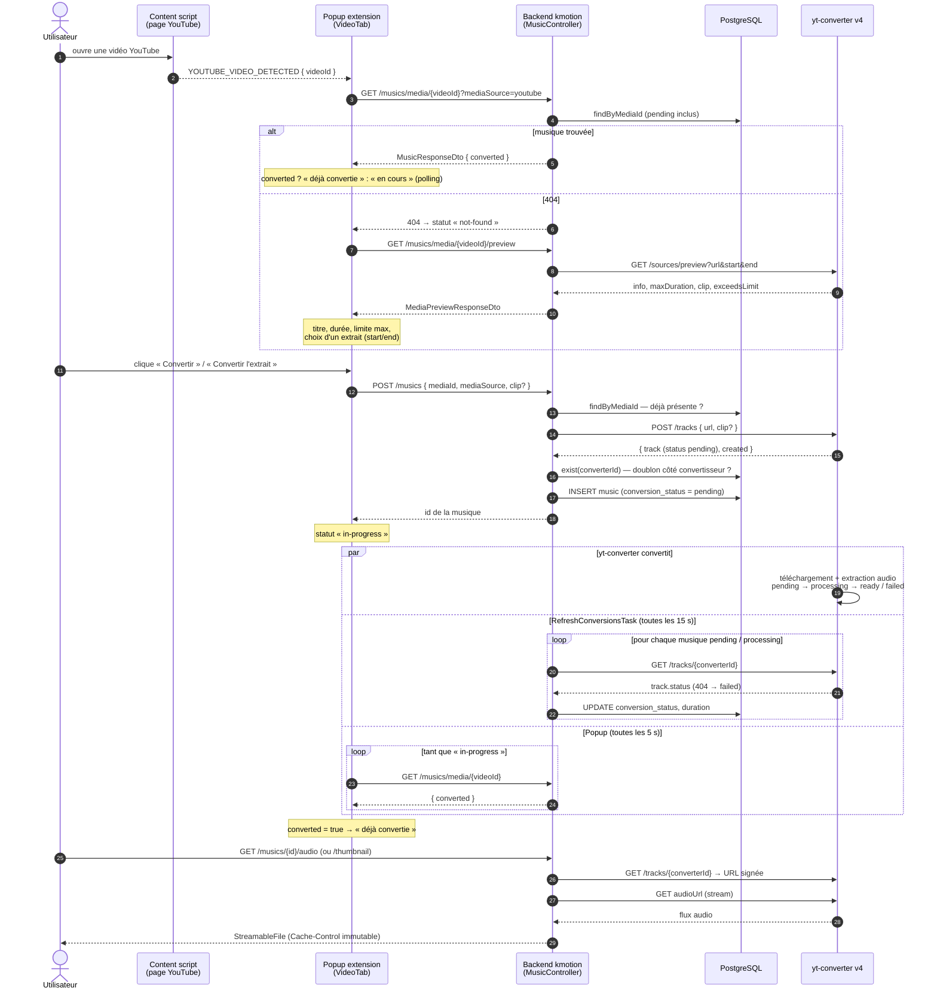
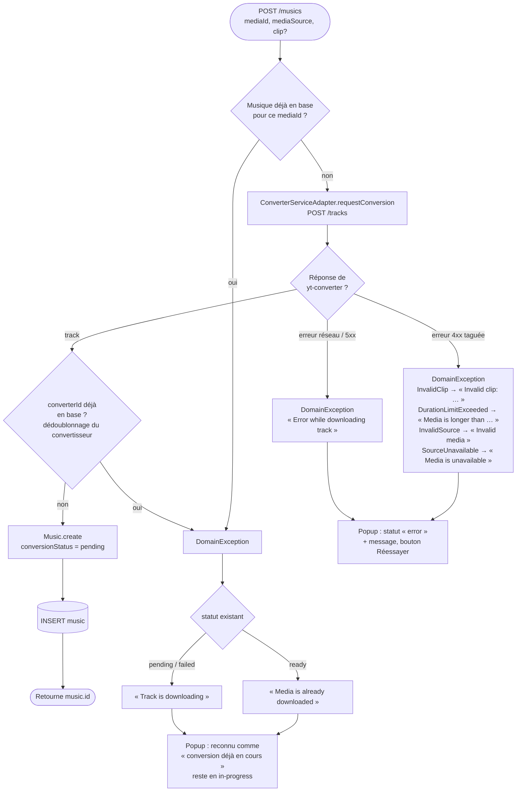
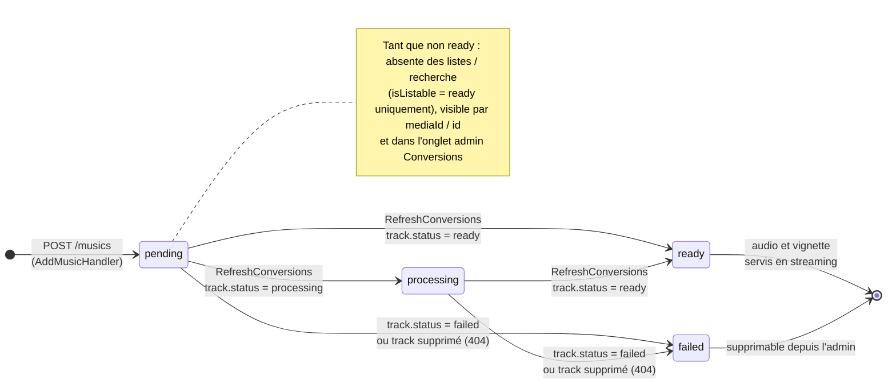
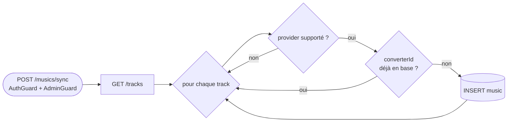

# Flux de conversion d'une vidéo

Ce document décrit comment une vidéo YouTube devient une musique de la bibliothèque kmotion :
depuis l'extension navigateur, à travers le backend (`apps/server`, module `music`), jusqu'au
service de conversion externe **yt-converter v4**.

La conversion est **asynchrone** : le backend enregistre la musique tout de suite en `pending`,
puis une tâche planifiée interroge le convertisseur jusqu'à ce qu'elle passe `ready` ou `failed`.

## Acteurs

| Acteur | Code |
| --- | --- |
| Content script / service worker | `apps/extension/src/content.ts`, `background.ts` — détectent l'id de la vidéo YouTube ouverte |
| Popup de l'extension | `apps/extension/src/components/tabs/VideoTab.tsx`, client `utils/api.ts` |
| `MusicController` | `apps/server/src/music/presentation/music.controller.ts` |
| Handlers CQRS | `PreviewMediaHandler`, `AddMusicHandler`, `RefreshConversionsHandler` |
| `ConverterServiceAdapter` | `music/infrastructure/adapters/converter-service.adapter.ts` (+ `converter-mapping.ts`) |
| `YtConverterHttpService` | `core/converter/yt-converter-http.service.ts` — client HTTP de yt-converter |
| `RefreshConversionsTask` | `music/infrastructure/tasks/refresh-conversions.task.ts` — toutes les 15 s |
| PostgreSQL | table `music` (colonne `conversion_status`) |

## Vue d'ensemble (séquence)

## Décisions de `AddMusicHandler` (`POST /musics`)

> Les messages `Media is already downloaded` / `Track is downloading` sont reconnus par
> l'extension (`isInProgressError`) : ne pas les modifier sans mettre à jour `VideoTab.tsx`.

## Cycle de vie d'une conversion

Les quatre états de yt-converter sont conservés tels quels par `toConversionStatus`
(`converter-mapping.ts`) : `pending` = en file d'attente, `processing` = conversion en cours.

## Suivi admin des conversions

L'onglet **Administration → Conversions** (`apps/web/src/features/admin/components/ConversionsSection.tsx`)
appelle `GET /musics/conversions` (admin, `FindConversionsQuery` → `findUnfinished`) toutes les 5 s :
toutes les musiques non `ready`, de la plus ancienne à la plus récente, avec un badge
« En file d'attente » / « Conversion en cours » / « Échouée ». Une conversion échouée peut être
supprimée pour libérer la vidéo et la relancer.

## Synchronisation manuelle (admin)

`POST /musics/sync` (`SyncMusicHandler`) récupère **tous** les tracks de yt-converter
(`GET /tracks`) et enregistre ceux dont la source est supportée et qui ne sont pas encore en base
(`MusicsFactory.fromTrack`). Utile pour rattraper des conversions faites hors de kmotion.

## Points à retenir

- **Une musique par média** : un second extrait d'une vidéo déjà présente est refusé, même si
  yt-converter le considérerait comme un track distinct.
- **URLs signées non stockées** : les colonnes `audio`/`thumbnail` restent vides ; à chaque
  lecture, le backend redemande le track au convertisseur pour obtenir une URL signée valide,
  puis relaie le flux. Tant que la conversion n'est pas finie, `/audio` répond 404.
- **Deux boucles de polling indépendantes** : la tâche serveur (15 s) met à jour la base, la
  popup (5 s) relit la base. Le délai perçu est donc au pire ~20 s après la fin réelle.
- **Échec côté popup** : la popup ne regarde que `converted` ; une musique passée `failed` reste
  affichée « en cours » et le polling continue tant que la popup est ouverte.
